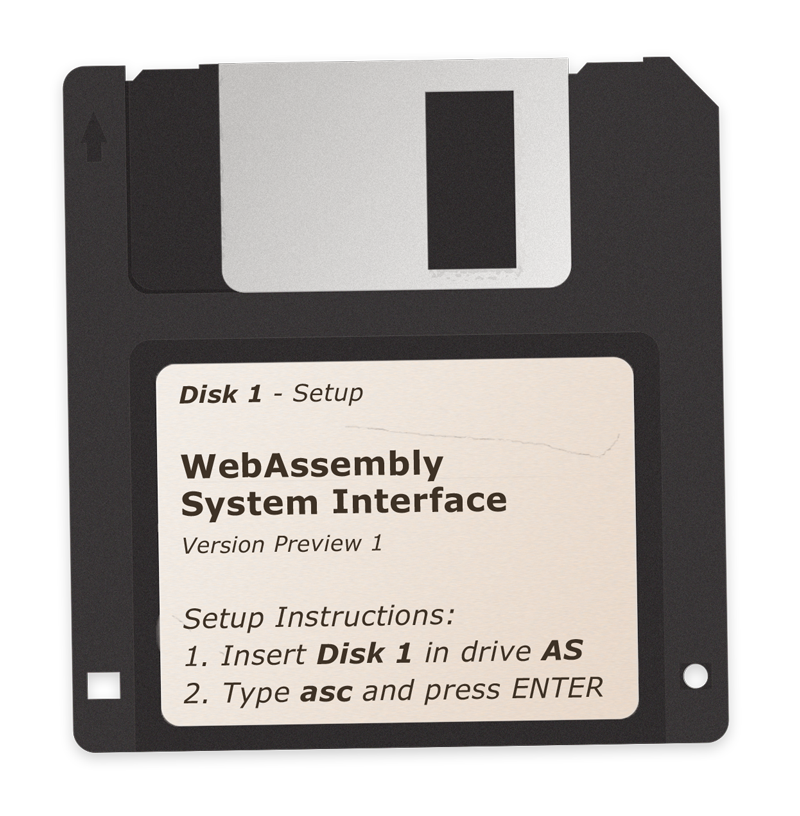

# WASI shim for AssemblyScript

[](https://github.com/AssemblyScript/wasi-shim/actions/workflows/test.yml) [](https://github.com/AssemblyScript/wasi-shim/actions/workflows/publish.yml)

Patches the AssemblyScript compiler to utilize WASI imports instead of Web APIs.

<p align="center"></p>

Note that this shim also serves a higher purpose, that is as an example of how to target any non-standard interface with the AssemblyScript compiler, including your own!

## Supported features

See the [assembly](./assembly) folder for the concrete implementations.

| Component   | Functionality
|-------------|----------------------------------------------------------------------
| console     | assert, log, debug, info, warn, error, time, timeEnd
| crypto      | getRandomValues
| date        | now
| internal    | abort, trace, seed
| performance | now
| process     | arch, platform, argv, env, exitCode, stdin¹, stdout¹, stderr¹, hrtime

¹ Limited/basic support

## Usage

First, install the WASI shim alongside the AssemblyScript compiler:

```
npm install --save-dev @assemblyscript/wasi-shim
```

Afterwards, reference the provided [configuration file](./asconfig.json) in your builds.

**Option 1: Command line**

When invoking `asc` manually, add `--config ./node_modules/@assemblyscript/wasi-shim/asconfig.json` as a command line option.

**Option 2: Config file**

When using an `asconfig.json` for your project, extend the provided configuration file instead:

```js
{
  "extends": "./node_modules/@assemblyscript/wasi-shim/asconfig.json",
  // ...
}
```

That's it. The AssemblyScript compiler now emits WASI-compatible modules. No more Web APIs!

## Migrating from 0.20

Using this shim offers almost identical functionality to the former WASI support that was included with the AssemblyScript compiler up to version 0.20. The differences are:

* The prior `import "wasi"` mechanism is no longer necessary and hence no longer supported.
* The compiler does no longer try to detect if a module is a WASI command or reactor. By default, a command will be assumed. For a reactor, specify `--exportStart _initialize`. See the WASI documentation for differences.

## Considerations

Since version 0.21, AssemblyScript considers WASI, derived proposals, the W3C's endorsement of its subgroup and the Bytecode Alliance's practices, that not all of their respective members necessarily are aware and/or approve of, harmful to open standards in general and the WebAssembly specification in particular.

The AssemblyScript project neither endorses nor officially supports any particular custom interface suitable to undermine purpose, goals and/or values of open Web standards. This package is nonetheless provided to our community for those who, given the subsequently established market situation, have no other choice than to use such interfaces or derived products. Regardless of the existence of this package, we explicitly welcome healthy competition in the rich design space of modern host interfaces. Specifically, we'd love to see (and use) a truly open host interface that keeps the Web in mind, i.e. adheres to WebAssembly's goals, while being portable, secure and efficient for many programming languages — including those that are a natural fit for the Web platform.
